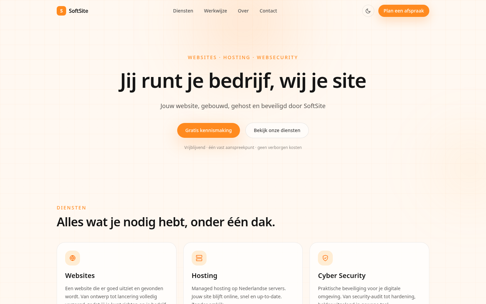
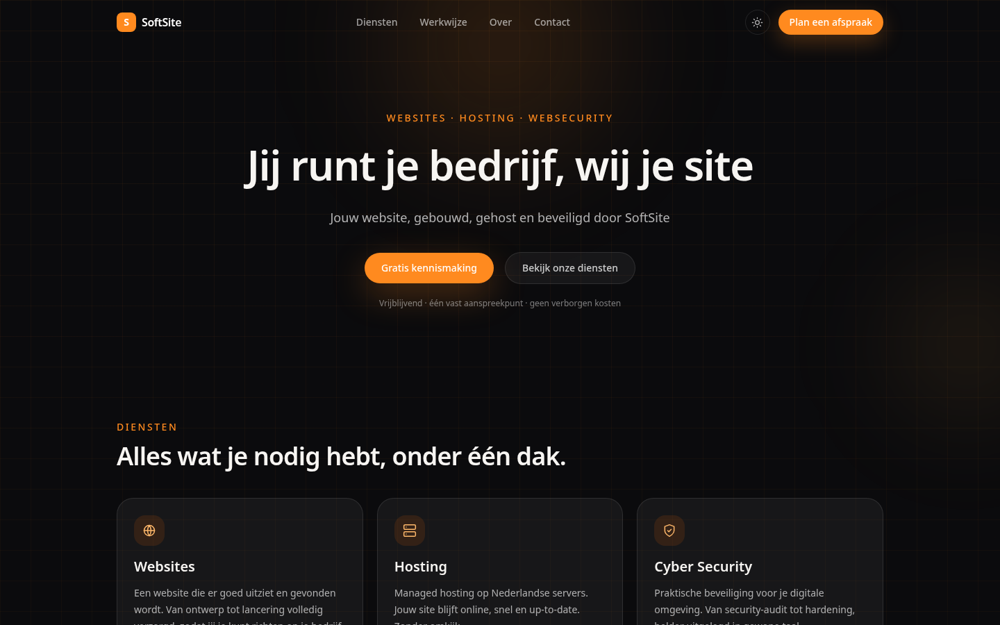
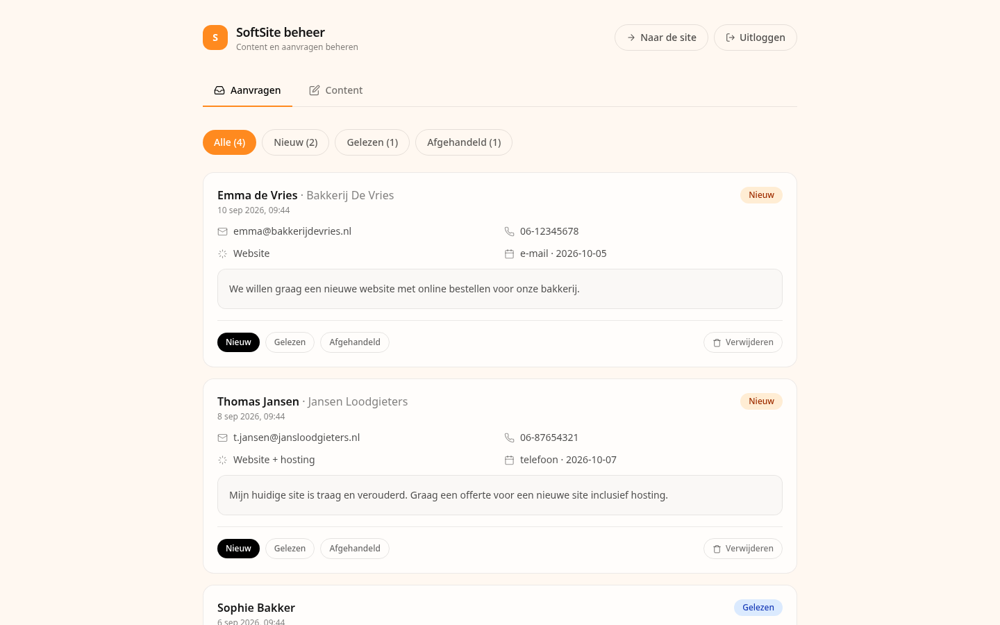

# SoftSite — Website, Hosting & Web Security

**SoftSite** is a full stack website for a small Dutch agency that builds, hosts
and secures websites for entrepreneurs. It pairs a polished one-page marketing
site with a private admin portal where the owner can edit every text on the
site and manage incoming appointment requests.

Built as a portfolio project to demonstrate end-to-end ownership of a modern
web product: design, frontend, backend, database, authentication, deployment
and documentation.

| | |
| --- | --- |
| **Frontend** | React 19 · TypeScript · Vite 8 · Tailwind CSS v4 |
| **Backend** | Node.js · Express 5 · better-sqlite3 (SQLite, WAL) |
| **Auth** | scrypt password hashing · HMAC-signed session tokens · httpOnly cookies |
| **Deployment** | VPS behind Cloudflare (DDoS protection, DNS, TLS) |

---

## Screenshots

| Home (light) | Home (dark) | Admin portal |
| :---: | :---: | :---: |
|  |  |  |

---

## Features

### Public one-pager (`/`)

- **Hero** with rotating taglines (fade + slide, stops for `prefers-reduced-motion`).
- Sections: **Diensten** (services) · **Werkwijze** (how we work) · **Over** (about) · **Contact**.
- **Contact form** that submits an appointment request straight to the backend.
- **Dark mode** with a manual toggle that respects the OS preference and persists to `localStorage`.
- Responsive from phone to desktop, including a fixed mobile menu.
- All copy is **served from the API**, with a bundled fallback so the site never renders empty.

### Admin portal (`/admin`)

- Login with **scrypt-hashed passwords** and **HMAC-signed session tokens** stored in httpOnly cookies.
- **Requests inbox** — view incoming appointment requests, filter by status, move them through
  `new → read → handled`, and delete.
- **Content editor** — edit company details, hero, services, process steps, about and contact
  copy; changes are stored in SQLite and visible on the site immediately.

---

## Tech stack

| Layer | Technology | Why |
| ----- | ---------- | --- |
| Frontend | React 19 + TypeScript | Component model + type safety |
| Build | Vite 8 | Fast dev server, production bundle |
| Styling | Tailwind CSS v4 | Design tokens, dark mode, no hand-rolled CSS files |
| Routing | react-router-dom 7 | SPA routes `/` and `/admin` |
| Backend | Node.js + Express 5 | REST API + static hosting in one process |
| Database | SQLite via better-sqlite3 | Zero-config, synchronous, WAL mode, single file |
| Auth | scrypt + HMAC tokens | No external auth dependency |
| Tooling | TypeScript, oxlint, concurrently | Checks and parallel dev scripts |

---

## Getting started

**Requirements:** Node.js 22+ (npm included).

```bash
npm install       # install dependencies (once)
npm run dev:all   # Vite on :5173 + API on :3001 (proxied), started together
```

| What | URL |
| ---- | --- |
| Website (dev) | http://localhost:5173 |
| API health check | /api/health |
| Admin portal | admin |

Production-style run:

```bash
npm run build   # type-check + build the frontend into dist/
npm start       # serve the built site + API on http://localhost:3001
```

Other scripts: `npm run dev` (frontend only), `npm run dev:server` (API only,
with `--watch`), `npm run lint` (oxlint), `npm run preview` (preview the build).

### Admin login

- Default credentials: `LeonB` / `standaard_wachtwoord`
- Change them via the `ADMIN_USER` / `ADMIN_PASSWORD` environment variables and
  restart the server. **Change the defaults before exposing the site publicly.**

## Environment variables

| Variable | Default | Description |
| -------- | ------- | ----------- |
| `PORT` | `3001` | Port the Express server listens on |
| `ADMIN_USER` | `LeonB` | Admin portal username |
| `ADMIN_PASSWORD` | `standaard_wachtwoord` | Admin portal password |
| `DB_PATH` | `server/data.sqlite` | Path to the SQLite database |

## API overview

| Method | Endpoint | Auth | Description |
| ------ | -------- | ---- | ----------- |
| `GET` | `/api/health` | — | Health check |
| `GET` | `/api/content` | — | Full site content |
| `POST` | `/api/bookings` | — | Submit an appointment request |
| `POST` | `/api/auth/login` / `/logout` | — | Session login / logout |
| `GET` | `/api/auth/me` | session | Current session state |
| `GET` | `/api/admin/bookings` | session | List requests (filterable by status) |
| `PATCH` | `/api/admin/bookings/:id` | session | Update request status |
| `DELETE` | `/api/admin/bookings/:id` | session | Delete a request |
| `PUT` | `/api/admin/content` | session | Replace site content |

See [API reference](docs/api-reference.md) for full request/response details.

## Project structure

```text
SoftSite/
├── src/                    # React frontend (TypeScript + Tailwind)
│   ├── components/         # Navbar, Footer, HeroCycle, Icon, PageBackground
│   ├── context/            # ContentContext — fetches and shares site content
│   ├── lib/                # types, API client, fallback content
│   └── pages/              # Home (one-pager) and Admin (portal)
├── server/                 # Node.js / Express backend
│   ├── index.js            # public + admin routes, static hosting, SPA fallback
│   ├── auth.js             # scrypt password hashing + HMAC session tokens
│   └── db.js               # SQLite setup, schema, seed and queries
├── shared/
│   └── content.default.json # default content (database seed + frontend fallback)
├── docs/                   # in-depth documentation (in Dutch)
└── public/                 # static assets (favicon)
```

## Notable engineering details

- **Hand-rolled auth** — scrypt password hashing, HMAC-signed session tokens,
  httpOnly/SameSite cookies; admin routes protected by middleware.
- **Live-editable content** — the whole site is data-driven; the admin portal
  rewrites the SQLite content blob and the site picks it up on next load.
- **No build step for the server** — plain modern Node.js (ESM), zero framework
  magic beyond Express.
- **Resilient UI** — `prefers-reduced-motion` support, focus-visible styles,
  graceful fallbacks so the navbar stays opaque on older mobile browsers.
- **Documented** — architecture, database, API, frontend, backend, conventions
  and deployment guides in [`docs/`](docs/).

## Deployment

The site runs on a VPS behind **Cloudflare** (DNS, TLS, DDoS protection):

```
Visitor → Cloudflare (DDoS · DNS · TLS) → VPS (Node.js app) → SQLite
```

See [deployment.md](docs/deployment.md) (Dutch) for the full setup.

## Roadmap

- [ ] Fill in real contact details (phone, e-mail, KvK, VAT) via `/admin` → Bedrijf
- [ ] E-mail notifications for new appointment requests
- [ ] Hook up the real domain name and hosting/VPS

## Author & license

Built by **Leon Boussen.** as a portfolio project.

Copyright © 2026 Leon Boussen
All rights reserved. No license granted.
<br>
You may not copy, modify, distribute, or use this software
without prior written permission from the copyright holder.